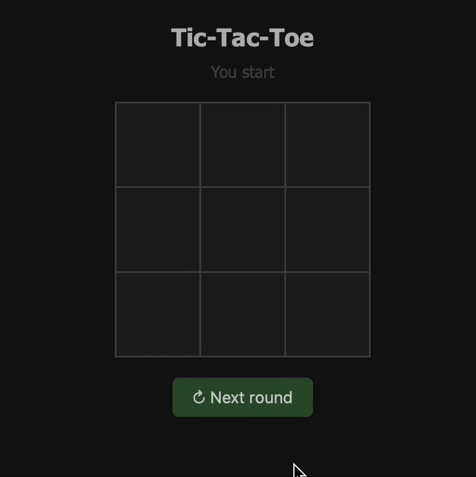
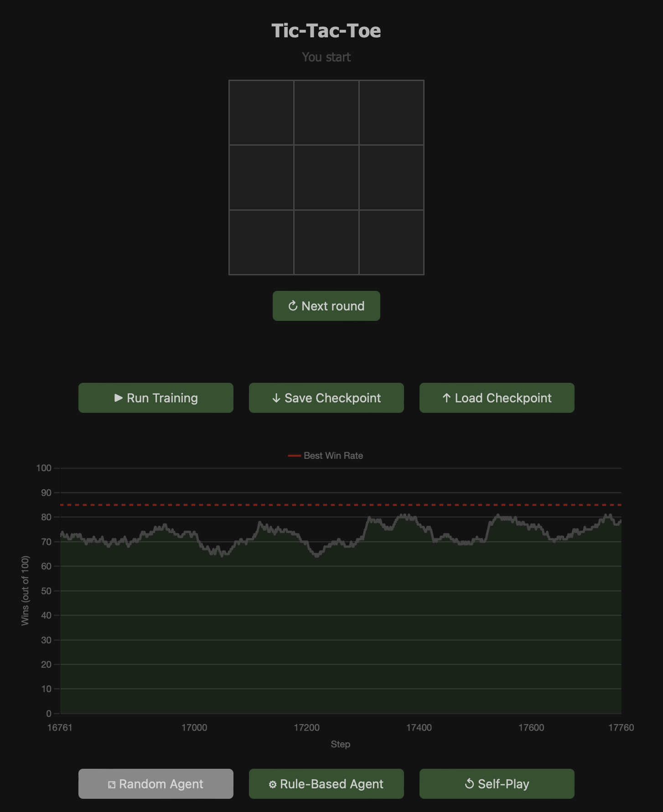

# Tic-Tac-Toe PPO Agent

A Transformer-based reinforcement learning agent for Tic-Tac-Toe, trained using Proximal Policy Optimization (PPO). This project includes training utilities, REST API endpoints, and a simple web interface for playing against the agent. An example gameplay session with the trained agent is shown below.

<p align="center">
    <br>
        
    <br>
        <em>Playing against the trained agent.</em>
    <br>
</p>


### 🚀 Features
- PPO-based agent with Generalized Advantage Estimation (GAE)
- Multiple opponent types: random, rule-based, and self-play
- REST API powered by FastAPI for training and gameplay
- Save and load the best-performing agent checkpoint
- Web interface for human-agent interaction
- Train the agent by interacting through the web interface
- Live training metric logging
- Full unit test suite


### 🧩 Project Structure
```bash
.
├── src/tictactoe/           # Core logic (agents, model, environment, API)
│   ├── agents/              # Agent implementations
│   ├── api/                 # FastAPI app and API routes
│   ├── model.py             # Actor-Critic model
│   ├── environment.py       # Game environment and rewards
│   ├── trainer.py           # Training loop logic
│   └── config.py            # Configuration parameters
├── frontend/                # Web interface (HTML + JS)
├── tests/                   # Unit tests for key components
├── checkpoints/             # Saved agent models
├── .devcontainer/           # VS Code Dev Container setup
├── Dockerfile               # Docker container
├── docker-compose.yml       # Full-stack orchestration
├── pyproject.toml           # Poetry configuration
```

### ▶️ Quick Start

Ensure you have Docker and Docker Compose installed. Then launch the app:
```bash
docker-compose up --build
```

The game UI will be available at: `http://localhost:8000`.


### 🎮 UI Overview
The web UI allows you to interact with the agent and control training directly
from your browser (see screenshot below).

<p align="center">
    <br>
        
    <br>
        <em>Tic-Tac-Toe user interface.</em>
    <br>
</p>

UI Components:

1. **Game Board**
    - 3×3 interactive grid for playing against the agent.
    - You always play first.

2. `↻ Next round` **button**
    - Resets the board and starts a new round after a game ends.
    - In the next round, the opponent goes first.

3. **Checkpoint Controls**
    - `↓ Save Checkpoint`: Saves the current best agent to disk.
    - `↑ Load Checkpoint`: Loads the best saved agent from disk.

4. **Training Controls**
    - `▶ Run Training`: Starts PPO agent training.
    - `⚁ Random Agent`: Opponent playing randomly.
    - `⚙ Rule-Based Agent`: Opponent using simple heuristics.
    - `↺ Self-Play`: Agent plays against a copy of itself.

5. **Training Progress Graph**
    - Displays the win rate of the PPO agent across training steps (max 100 games per point).
    - Red line shows the highest recorded win rate.
    - The graph updates in a sliding-window manner, displaying only the latest 1000 points.


### ⚙️ Model Architecture

The agent is based on a dual-encoder Transformer Actor-Critic architecture, implemented in PyTorch.
The actor and critic use separate encoders and heads, allowing them to learn specialized
representations of the board state.

```
        ┌──► Embeddings ─► Transformer ─► Pooling + GELU(FC) ─► Actor Head ─► Action Logits
Input ──┤
        └──► Embeddings ─► Transformer ─► Pooling + GELU(FC) ─► Critic Head ─► Value Estimate
```

- **Input**:
    - The game board is encoded as a flat sequence of 9 integers (3×3), where each cell represents one of three states:
    `0 = empty`, `1 = opponent`, `2 = agent`.

- **Actor Encoder**:
    - Embedding layer for cell states.
    - Sinusoidal positional encoding.
    - Transformer Encoder stack (configurable depth, heads, width).
    - Sum-polling and linear projection with activation.

- **Critic Encoder**:
    - Mirrors the actor's architecture but with independent parameters. This allows
    the critic to learn a distinct representation of the board for value estimation.

- **Heads**:
    - Actor Head: Produces logits over all board positions. Invalid moves
    (non-empty cells) are masked during action selection.
    - Critic Head: Outputs a scalar value estimating the state's value (expected future reward).

- **Training**:
    - Proximal Policy Optimization.
    - Optional: Generalized Advantage Estimation.
    - Optional: reward normalization, advantage normalization, advantage centralization.
    - Optional: policy entropy regularization.
    - Actor and critic are trained independently with separate optimizers, using shared trajectory memory.

This architecture enables independent learning of policy and value functions 
while leveraging Transformer expressiveness.

### ✅ Running Tests
```bash
poetry run pytest
```

### 📄 License
[MIT License](https://github.com/artem-gorodetskii/Tic-Tac-Toe-PPO/blob/main/LICENSE)
